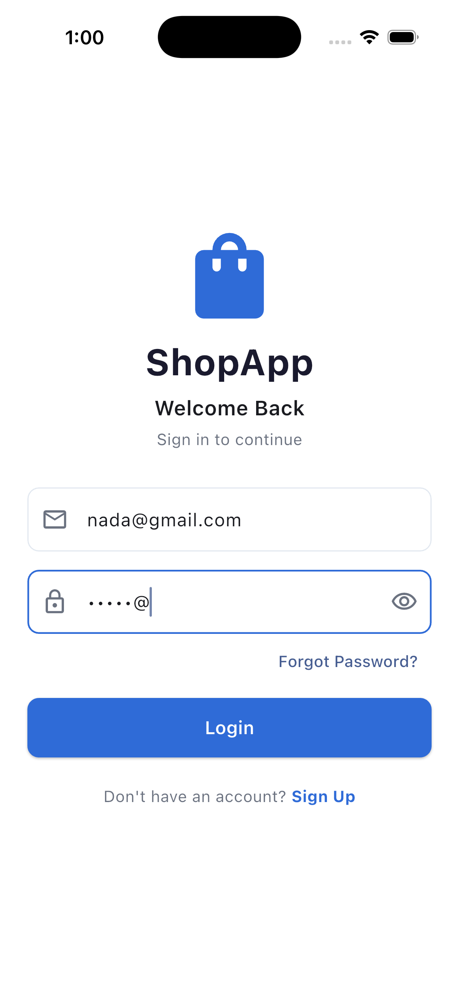
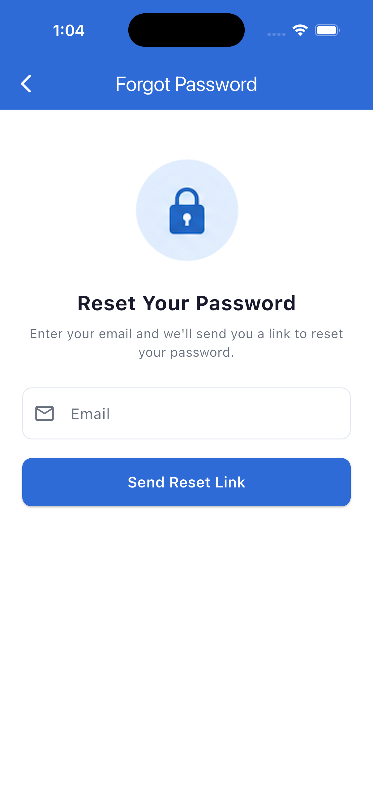
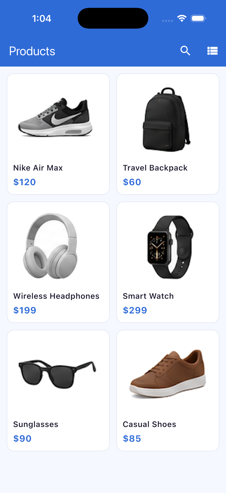
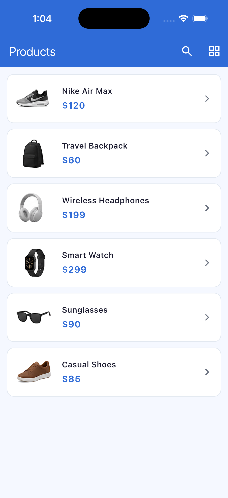
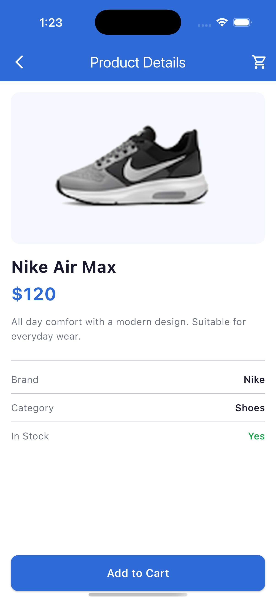

# Shop App

**Student name:** Nada 

A Flutter shopping app built for the Flutter Mid Exam.

## Screens

### 1. Login

### 2. Forgot Password

### 3. Products (Grid)

### 4. Products (List)

### 5. Product Details

## Features

- Login and Forgot Password forms with validation
- Navigation between all screens
- Products shown in grid and list layouts
- Tapping a product opens its details
- Local dummy product data (no JSON or API)
